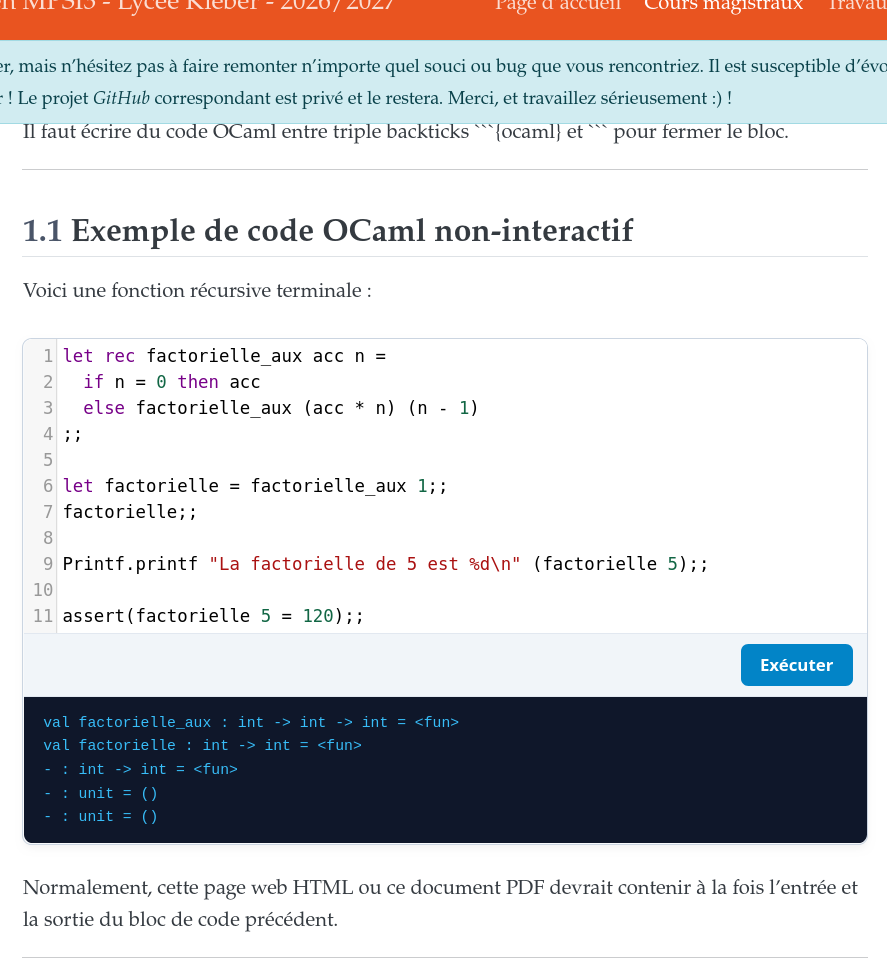

# OCaml-live Extension For Quarto

Cette extension pour [Quarto](https://quarto.org) transforme les blocs [OCaml](https://ocaml.org) explicitement marqués `live: true` en cellules modifiables avec [CodeMirror](https://codemirror.net), dans son format dédié `live-html`.
Les autres blocs restent statiques par défaut, et les sorties HTML standard, Reveal.js et PDF conservent leur comportement habituel.

## TODO

🇫🇷 -> 🇬🇧: Translate this README.md to English only!

----

## Installing

```bash
quarto add Naereen/quarto-ocaml-live
```

This will install the extension under the `_extensions` subdirectory.
If you're using version control, you will want to check in this directory.

----

## Using

Le kernel Basthon est initialisé de façon asynchrone via son API principale et son worker Comlink. Les boutons d'exécution ne sont activés qu'une fois le kernel prêt; les sorties standard et d'erreur sont affichées séparément.

Le format interactif est `live-html`, dérivé du format HTML de Quarto.

### Options de cellules (méta-commentaires)

Les options de cellules peuvent être déclarées au début d'un bloc de code OCaml sous forme de méta-commentaires `(*| clef: valeur *)` :

````markdown
```{ocaml}
(*| live: true *)
(*| autorun: true *)
(*| echo: true *)
(*| eval: true *)
(*| caption: "Une factorielle récursive terminale et interactive" *)
let rec factorielle_aux acc n =
  if n = 0 then acc
  else factorielle_aux (acc * n) (n - 1)
;;
let factorielle = factorielle_aux 1;;
Printf.printf "5! = %d\n" (factorielle 5);;
```
````

#### Comportement des options :

- `live: false` (**par défaut**) : la cellule conserve le comportement standard d'une cellule Quarto/Jupyter (évaluation statique et non-interactive), y compris dans `live-html`.
- `live: true` : transforme la cellule en éditeur interactif CodeMirror avec exécution dans le navigateur via Basthon uniquement dans le format `live-html` ; reste statique dans les autres formats, comme HTML standard, Reveal.js ou PDF.
- `autorun: false` (**par défaut**) : la cellule attend une action manuelle de l'utilisateur sur le bouton « Exécuter ».
- `autorun: true` : dès que le noyau OCaml a terminé son chargement, les cellules marquées avec `autorun: true` s'exécutent automatiquement l'une après l'autre, de haut en bas dans l'ordre de la page.
- `caption: "..."` (vide par défaut) : ajoute un titre/légende pour cette cellule, qui sera aligné à gauche dans la barre de contrôle de la cellule, à côté du bouton d'exécution.
- `echo: false` : n'affiche pas les flux de sortie standard/erreur (stdout/stderr). Par défaut (`echo: true`), les sorties sont incluses.
- `eval: false` : désactive l'évaluation de la cellule (par défaut `eval: true`).

> **Remarque :** lorsque le document est exécuté par le moteur Jupyter (`jupyter: ocaml-jupyter-…`), Quarto lit lui-même les méta-commentaires `(*| … *)` : `echo` et `eval` y gardent leur sens Quarto habituel (`echo: false` masque le *code* ; utilisez `output: false` pour masquer les *sorties* statiques), et une cellule `live: true` avec `echo: false` ne peut pas être rendue interactive, faute de code source.
> Les options `live`, `autorun` et `caption` sont transmises au filtre Lua par Quarto.

Voir [example.qmd](example.qmd) pour un exemple complet de document.

## Demonstration



Une cellule "ocaml-live" avec `autorun: true` en meta-commentaire :


Une cellule "ocaml-live" sans `autorun: true` en meta-commentaire :


----

## :scroll: License ? [](https://github.com/Naereen/quarto-ocaml-live/blob/master/LICENSE)

[MIT Licensed](https://lbesson.mit-license.org/) (file [LICENSE](LICENSE)).
© [Lilian Besson](https://GitHub.com/Naereen), septembre 2026.

[](https://GitHub.com/Naereen/quarto-ocaml-live/graphs/commit-activity)
[](https://GitHub.com/Naereen/ama)
[](https://GitHub.com/Naereen/quarto-ocaml-live/)

[](https://GitHub.com/Naereen/)

[](http://ForTheBadge.com)
[](https://GitHub.com/)
[](http://ForTheBadge.com)
[](http://ForTheBadge.com)
[](http://ForTheBadge.com)


